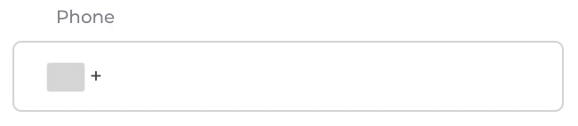

# React mask-field

React input mask with simply interface and just customisation

**Features** 

- **colorizes mask**
- works with different mask
- takes different validators 
- can works with copy/paste events
- supports dynamic changed masks
- supports all major browsers
- no external dependencies

[demo](https://mask-52cec.firebaseapp.com/)


 

### Setup

Install the package
`npm i mask-field --save`

### Use

React Mask exports default MaskField component

```
import MaskField from "mask-field"
import "mask-field/lib/index.css"
```

**importing styles are require for correct work**

MaskField has interface look like simple native input with two addition props (`mask`, `separators`)

`mask` is showing how transform value
`separators` are array of symbols who must be a skipped

We just should need paste MaskField in yours component and hand over needs props 

```
<MaskField
  value={value}
  mask={mask}
  separators={separators}
  onChange={onChange}
  placeholder="placeholder"
  modifiers={modifiers}
/>
```

### Props

| Prop | Required | Type | Description | Example |
| :--- | :---: | :---: | :---: | ---: |
| `mask` | true | string | pattern | "xxx (xx) xxx xx xx" |
| `separators` | true | string[] | to skipping symbols | [" ", "(", ")"] |
| `value` | true | string | input value | - |
| `onChange` | true | func | on change cb | - |
| `validators` | false | func[] | list of validators who will call by chain. (default [isNumber]) (value: string): string | undefined | [isNumber] |
| `placeholder` | false | string | showing with empty input | - |
| `modifiers` | false | string | setting custom styles | - |
| `modifiersErrors` | false | string | setting custom styles for errors container | - |
| `type` | false | string | input type (default `tel`), **don't have to use number** | string |
| `withErrors` | false | bool | trigger for visible errors block (default false) | true |
| `errors` | false | string[] | array of errors | ["Value is not a number"] |
| `disabled` | false | bool | flag for disabling input | true |
| `readOnly` | false | bool | flag for set readOnly in input | true |


### Advance

If you want using custom react input component, mask exports additional wrapper.

```
import { MaskWrapper } from "mask-field"
import "mask-field/lib/index.css"
```

You should wrap your custom input and hand over props

example:

```
<MaskWrapper
  value={value}
  mask={mask}
  errors={errors}
  separators={[" "]}
  onChange={onChange}
  modifiers={modifiers}
>
  {({
    maskInputStyle,
    maskInputWrapperStyle,
    inputRef,
    value,
    handleMaskChange,
  }) => (
      <Input
        type="tel"
        wrapperModifiers={maskInputWrapperStyle}
        modifiers={joinClasses("input", maskInputStyle)}
        value={value}
        required={required}
        onChange={handleMaskChange}
        name={name}
        readOnly={readOnly}
        disabled={isDisabled}
        tabIndex={tabIndex}
        onBlur={onBlur}
        inputRef={inputRef}
      />
    )
  }
</MaskWrapper>
```

**In children MaskWrapper returns props who needed hand over to custom input**

### Mask utils

If you want using simply function to transform value to custom mask or cut all separators
You can import `prepareValueFromMask, prepareValueToMask`  

`import { prepareValueFromMask, prepareValueToMask } from "mask-field""`

example:

```
const value = "375292222222"
const mask = "xxx (xx) xxx xx xx"
const separators = [" ", "(", ")"]

prepareValueToMask(value, mask, [" "])
  .toBe("375 (29) 222 22 22")
```

```
prepareValueFromMask("12/01/2000", ["/"]))
  .toBe("12012000")
```
